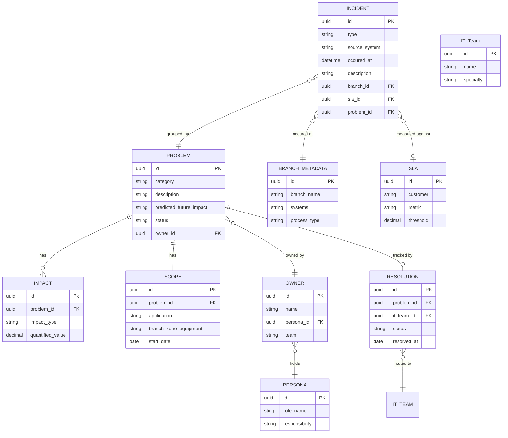

# Operations Problem Navigator — Entity Relationship Diagram

Data model derived from the Medline Cycle 60 RFP: incidents captured through a common intake, grouped by AI modeling into Problem records with impact, scope, ownership, and resolution tracking.

